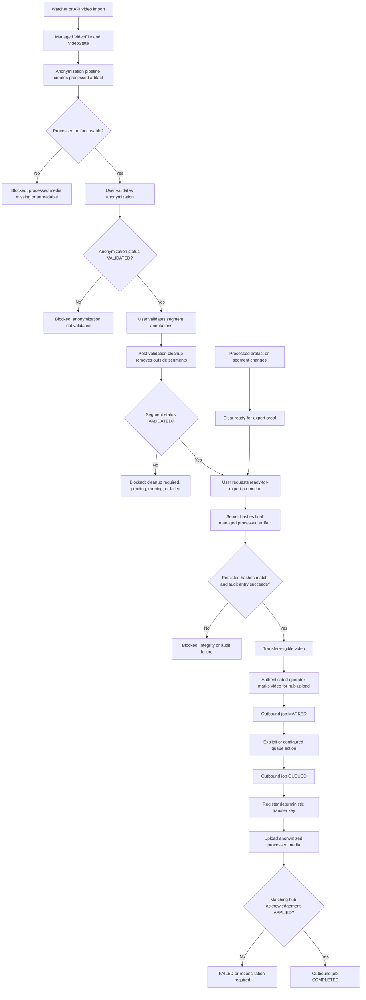

# Hub Export Workflow

This page defines the sender-side workflow for `lx-annotate` when a site node
exports anonymized resources to a hub deployment.

It is the local companion to the upstream hub receive contract in
`endoreg_db`. The goal is to make outbound transfer restart-safe, idempotent,
and explicit for operators in a high-stakes clinical environment.

## Scope

This workflow applies to:

- anonymized videos
- anonymized reports
- processed media transfer from a site node to a hub

This workflow does not apply to:

- the implementation details of watcher or API ingest into the local node;
  successful ingest is the prerequisite that creates the local video and its
  managed artifacts
- raw-media transfer
- the legacy annotation-segment export screen

## Core Decisions

- `center_key` is the canonical machine-facing center identifier
- transfer is permitted only for anonymized resources
- the sender exports only anonymized processed media
- import alone never makes a video transferable
- transfer is explicit: a resource must be marked for upload before it may be
  queued
- retries must reuse the same logical transfer identity

## Video Reachability From Import To Transfer

The following directed acyclic graph (DAG) separates automated import and
processing from explicit user approvals. Every gate is fail closed. Import may
create a processed artifact, but only the final green path can create and queue
an outbound transfer job.



The state can therefore be reached through normal product behavior; tests must
not manufacture `ready_for_export` directly. The reachability contract uses
the same model transitions and services as the import pipeline, segment
workflow, ready-for-export endpoint, Hub marking, and queueing code. Any later
processed-artifact replacement or segment mutation revokes the proof and sends
the video back to the readiness gate.

## Marked For Upload

`marked for upload` means:

- the resource is locally approved for outbound transfer to the configured hub
- the resource is eligible for transfer under the anonymization policy
- the resource has not necessarily been queued or transferred yet

This is a local sender decision, not a remote hub status.

The mark must be:

- persisted durably
- attributable to a user or explicit system action
- reversible before queueing

For the initial implementation, the mark should be per resource. Bulk marking
is allowed as a UI convenience, but it must be implemented as repeated
per-resource state changes, not as a separate domain concept.

## Eligible Resources

Video candidate eligibility and operator marking are separate states. A video
is a transfer candidate only when all of the following are true:

- it belongs to the local sender center scope
- its managed processed artifact exists and is non-empty
- anonymization status is exactly `VALIDATED`
- segment annotation status is exactly `VALIDATED`, which includes successful
  outside-segment cleanup
- `ready_for_export` is true with an attributable actor and timestamp
- `VideoFile.processed_video_hash` and
  `VideoState.processed_file_sha256` contain the same final processed-artifact
  digest

Overview polling trusts only the persisted integrity proof and does not read
the complete video. The marking and transfer boundaries recalculate the digest
from the actual managed artifact and reject unreadable content or any mismatch.
States such as `ANONYMIZED` and `DONE_PROCESSING_ANONYMIZATION` are useful
workflow progress, but are not transfer eligible until human anonymization
validation and every later gate has completed.

An authenticated operator may then create the separate `marked` transfer
intent. Marking does not repair or bypass a failed eligibility gate.

If the local state becomes ineligible after marking, the sender must refuse to
queue or retry the transfer until the resource becomes eligible again.

## Sender State Machine

The local outbound transfer ledger should use this state model:

- `not_marked`
  The default state. No outbound transfer intent exists.
- `marked`
  Operator-approved for transfer, but not yet queued for delivery.
- `queued`
  Ready for the sender worker to attempt registration with the hub.
- `registering`
  The sender is submitting transfer metadata to the hub.
- `awaiting_media`
  The hub accepted metadata and is waiting for processed media upload.
- `uploading`
  The sender is uploading processed media to the hub.
- `completed`
  The sender has received a terminal successful hub state.
- `failed`
  The last transfer attempt failed. The resource may be retried.

Allowed transitions:

- `not_marked -> marked`
- `marked -> not_marked`
- `marked -> queued`
- `queued -> registering`
- `registering -> awaiting_media`
- `registering -> completed`
- `registering -> failed`
- `awaiting_media -> uploading`
- `awaiting_media -> failed`
- `uploading -> completed`
- `uploading -> failed`
- `failed -> queued`

Terminal behavior:

- `completed` is terminal for the current transfer intent
- any retry after `completed` must first resolve to the existing logical
  transfer, not create a new one

## Transfer Identity

The sender must compute a deterministic `transfer_key`.

Recommended shape:

- `"{source_node_key}__{resource_kind}__{resource_hash}__processed_v1"`

Required properties:

- stable across retries
- unique for a resource content hash and transfer mode
- independent of local database primary keys

This key must be reused whenever the sender retries the same logical transfer.

## Transfer Mode Policy

The sender must use:

- `metadata_and_processed_media`

The sender must not use:

- `metadata_and_raw_media`
- `metadata_raw_and_processed_media`

That keeps the sender aligned with the upstream policy that only anonymized
data may be transferred.

## Retry And Reuse Rules

The sender must treat the following as idempotent reuse cases:

- the local outbound job restarts after a crash
- the metadata registration request times out and is retried
- the hub responds with an already-existing transfer for the same
  `transfer_key`
- processed media upload is retried after partial network failure

The sender must not create a new logical transfer when:

- the resource hash is unchanged
- the target node is unchanged
- the transfer mode is unchanged

A new logical transfer is required only when the transfer intent changes in a
way that would materially alter the hub-side contract, such as:

- a different target hub node
- a different resource hash
- a different transfer mode

## Sender Payload Responsibilities

Before contacting the hub, the sender must build a canonical payload that
matches the upstream transfer serializer.

At minimum, the payload must include:

- `transfer_key`
- `source_node_key`
- `target_node_key`
- `source_center_key`
- `resource_kind`
- `resource_hash`
- `transfer_mode`
- `processing_policy`
- `processing_intent`
- `cleanup_policy`
- `resource_rows`
- `processing_snapshot`

For video transfer, the sender must provide:

- `resource_rows.video_file`
- `resource_rows.video_state`
- `resource_rows.sensitive_meta` where available

For report transfer, the sender must provide:

- `resource_rows.raw_pdf_file`
- `resource_rows.raw_pdf_state`
- `resource_rows.sensitive_meta` where available

The sender must validate the payload locally before any network request is
issued.

For processed video media, local validation recalculates the Secure Hash
Algorithm 256-bit (SHA-256) digest from the actual processed artifact and
requires it to match both persisted video hash fields. The sender also requires
the declared source center to match the active source node's owning center and
requires the deterministic transfer key to match the source node, resource
kind, resource hash, and processed-media mode. Any mismatch stops before
registration, so neither metadata nor media is disclosed to the hub.

## Verified Hub Acknowledgement

Registration, status reconciliation, and media upload responses are treated as
untrusted protocol input even though the channel uses mutual Transport Layer
Security (mTLS). Every response must identify the same remote transfer, transfer
key, source node, target node, source center, resource kind, resource hash,
processed-media hash, transfer mode, and payload schema version.

The local job reaches `completed`, and local cleanup can become eligible, only
when the hub returns `applied` with this complete matching identity. A missing
or different field is a terminal acknowledgement-integrity failure; it is
persisted as `failed`, is not retried automatically, and does not permit local
cleanup.

## UI Workflow

The operator-facing export workflow should be derived from the anonymization
overview.

The new export page should:

- show anonymization readiness first
- allow marking and unmarking eligible resources
- show current outbound sender state
- keep the legacy annotation export page separate

The default filtered view should show only resources that are:

- anonymized
- locally complete enough to export
- not already completed for the current transfer intent

## Operational Requirements

Before queueing any transfer, the local node must have:

- one active local site `NetworkNode`
- one active target `central_hub` `NetworkNode`
- a configured source center scope
- a valid hub base URL
- valid node authentication material

If any of these are missing, the UI and sender worker must refuse to start
transfer work.

## Deployment And Operator Procedure

The site-node deployment must keep all credentials in mounted secret files,
not in Git, the database, or frontend configuration. A production sender uses
at least:

```sh
ENDOREG_DEPLOYMENT_ROLE=site_node
LX_ANNOTATE_HUB_EXPORT_REQUIRE_MTLS=true
LX_ANNOTATE_HUB_EXPORT_CLIENT_CERT_FILE=/run/secrets/hub-client.crt
LX_ANNOTATE_HUB_EXPORT_CLIENT_KEY_FILE=/run/secrets/hub-client.key
LX_ANNOTATE_HUB_EXPORT_CA_FILE=/run/secrets/hub-ca.crt
LX_ANNOTATE_HUB_SOURCE_NODE_SECRET_FILE=/run/secrets/hub-node-secret
LX_ANNOTATE_HUB_EXPORT_AUTO_QUEUE=false
LX_ANNOTATE_HUB_EXPORT_LOCAL_CLEANUP_POLICY=retain_processed_media
```

Use the node-specific
`LX_ANNOTATE_HUB_SOURCE_NODE_SECRET_<NORMALIZED_NODE_KEY>_FILE` setting when a
deployment has more than one sender identity. Never set TLS verification to
false. The target `NetworkNode.base_url` must use `https://`.

Before enabling queueing, an authenticated operator must:

1. Open the administration overview and confirm that one active site node,
   exactly one active hub target, an HTTPS target, readable mTLS files, and the
   configured certificate-authority bundle are reported ready.
2. Open the hub-export overview and confirm the displayed operator identity,
   target node, selected resource count, anonymization readiness, and privacy
   summary.
3. Mark only the reviewed resources. The overview must then show the persisted
   operator name and marking time. Do not use client-supplied actor fields.
4. Queue or enable automatic queueing only after this review. Bulk marking and
   unmarking are atomic; unmarking is allowed only while the job remains
   `marked`.
5. Follow the local job through registration, processed-media upload, and the
   verified remote `applied` acknowledgement. `awaiting_media`, `failed`, and
   `inconsistent` are not successful completion.

For a bounded recovery pass after a worker or broker outage, run:

```sh
python manage.py dispatch_hub_export_recovery --source-node-key <site-node-key>
```

This command only dispatches reconciliation. Inspect the administration
overview and the structured `lx_annotate.hub_export.audit` events afterward.
Retry exhaustion remains visible and must not be reset by changing the
`transfer_key`. A configuration or payload rejection and an acknowledgement
integrity inconsistency are terminal until an operator corrects and reviews
the cause.

Certificate rotation, hub-side proxy checks, storage-capacity response,
database-plus-media restore, quarantine handling, and the full incident
procedure are defined in the matching `endoreg_db` runbook:
`docs/hub_ingest_operations.md`. Rotate the certificate authority first, then
the client certificate and key with an overlap window; verify a complete
transfer before revoking the old identity.

During an incident, preserve the sender ledger, receiver ledger, proxy logs,
worker logs, and structured audit events. Correlate by outbound job ID,
`transfer_key`, source and target node, source center, remote transfer ID,
attempt number, acknowledgement, and cleanup decision. Do not copy secrets,
raw media, raw report text, absolute paths, or long-lived keys into tickets.
Disable the affected sender node when authentication or integrity compromise
is suspected, and resume only with the same transfer identity after the cause
has been reviewed.

The current production boundary is Phase 1: anonymized processed artifacts are
protected in transit by mutual Transport Layer Security (mTLS) and at rest by
each node's encrypted storage boundary. Standalone files or blobs must not
leave that boundary until Phase 2 implements and verifies per-transfer data
encryption keys wrapped for the receiving hub. Shared secrets and the
long-lived master key are never payload-encryption substitutes.

## Audit Requirements

The sender must record:

- who marked the resource for upload
- when it was queued
- when metadata registration started and finished
- when media upload started and finished
- the last failure reason
- the final sender-visible hub outcome

## Local Cleanup Policy

Sender-side cleanup is separate from hub receive-side cleanup.

The operational default is conservative:

- retain local processed artifacts after verified hub apply

An optional sender-side policy may mark local processed artifacts as
cleanup-eligible only after the hub has returned a successful terminal state.

Allowed sender policies:

- `retain_processed_media`
- `eligible_after_verified_apply`

This policy must never delete local artifacts before the sender has a verified
successful hub outcome.

## Summary

The sender-side workflow is intentionally explicit:

- processing completion makes a resource eligible
- operator marking authorizes export
- a local transfer ledger tracks progress
- retries reuse the same deterministic transfer identity
- only anonymized processed media is transferred
