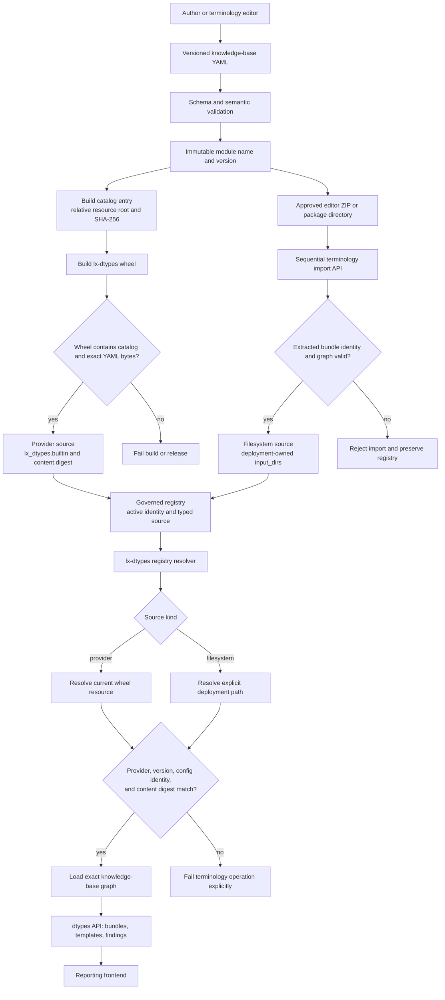

# Governed terminology delivery

Terminology shown by the reporting frontend is a deployed, versioned artifact.
It is not loaded from a developer checkout. The only runtime selection source
is the JSON file named by `LX_DTYPES_KB_REGISTRY`.

## Delivery path

1. Authors change YAML in `lx-data-models` or an approved terminology editor.
2. The complete knowledge-base graph is schema- and semantically validated.
3. The approved export receives an immutable module name and version.
4. An authorized terminology administrator selects one or more editor ZIPs, a
   package directory, or a directory containing complete package directories
   in *Settings -> Terminology*. ZIPs may come from local
   storage or a cloud location exposed by the operating system's file picker.
5. Folder selections are split at their top-level `config.yaml` files and
   packaged in the browser. Every resulting ZIP is sent sequentially through
   `POST /dtypes-api/terminology/bundles/import`; sequential processing prevents
   concurrent registry updates from overwriting one another.
6. The server validates each extracted artifact before atomically registering
   and activating its exact identity. A failed package is reported by name and
   does not stop the remaining packages. The last successful package is active.
7. Startup checks report missing or invalid terminology as an operational
   warning. Annotation remains available while terminology-dependent reporting
   shows its setup or error state.
8. The frontend reads the active identity, templates, and findings through
   `/dtypes-api/`. It never receives server filesystem paths.

## Delivery and runtime DAG

The two supported source paths remain distinct until the registry resolver
turns their stable descriptors into validated runtime inputs:



No edge writes a resolved wheel installation path back into the registry. A
new environment therefore resolves the same provider descriptor against its
own installed wheel and verifies the immutable content again.

The registry must contain the active identity and a typed source descriptor.
Deployment-owned imports use an explicit filesystem source:

```json
{
  "active": {
    "module_name": "gastroenterology_reporting",
    "version": "2026.07.31"
  },
  "modules": {
    "gastroenterology_reporting": {
      "2026.07.31": {
        "sources": [{
          "kind": "filesystem",
          "input_dirs": ["/var/lib/lx-annotate/data/terminology/packages/gastroenterology_reporting/2026.07.31"]
        }]
      }
    }
  }
}
```

Legacy top-level `input_dirs` entries remain readable for compatibility.
`input_dirs` and the registry path are server-private deployment data. Public
bundle responses expose identities and metadata only.

## Packaged reporting bundles

The installed `lx-dtypes` package provides three selectable reporting bundles:

- `dgvs_reporting` contains DGVS guideline-derived report templates and depends
  on the concept-only `DGVS_Terminology` module.
- `mst_3_0` contains MST 3.0 report templates.
- `star_upper_gi` contains the ESGE STAR Upper GI report templates.

`lx-dtypes` ships these immutable YAML trees and `data/catalog.json` inside its
wheel. The typed `lx_dtypes.knowledge_bases` API resolves a module, exact
knowledge-base version, package-relative resource root, and SHA-256 content
digest. A built-in registry entry persists only that stable identity:

```json
{
  "sources": [{
    "kind": "provider",
    "provider": "lx_dtypes.builtin",
    "content_sha256": "<catalog digest>"
  }]
}
```

The resolver obtains the current wheel's installation path at load time and
verifies the catalog digest. An absolute `site-packages`, virtual-environment,
or Nix-store path from an installed wheel must never be persisted. Missing
providers, absent versions, and digest conflicts fail explicitly.

The terminology bootstrap registers missing identities for all packaged
catalog bundles and fully loads every packaged bundle before succeeding. A
missing registry, an empty `{ "modules": {} }` registry, or a registry without
an active identity receives the configured/default packaged identity. If the
active entry is a stale built-in provider or a legacy filesystem entry pointing
into an installed wheel, bootstrap atomically replaces it with the matching
current catalog identity. An active custom or imported filesystem entry is
preserved, including an older custom version with the same module name.

The reporting frontend renders the registry entries returned by
`GET /dtypes-api/terminology/bundles` and loads templates only for the selected
bundle and examination.

## Prohibited runtime overlays

Do not use a checkout path, current working directory,
`LOOKUP_DTYPES_DATA_ROOT`, `LX_DATA_MODELS_ROOT`, a Nix source-tree input, a
browser default, or process-local active state as a clinical runtime source.
There is no public `/base_api/` compatibility mount. The canonical mount is
`/dtypes-api/`.

## Verification and release evidence

Verification is staged. Passing source tests does not prove a packaged
deployment:

1. Run the declared feature verifier exactly as recorded in
   `endoreg-db/feature-tracking/AssistedReportingApiIntegration.yml`.
2. Build the `lx-dtypes` wheel, install it into a clean environment, inspect
   its packaged catalog/YAML, register its provider descriptor, and load the
   intended module/version.
3. Build the matching frontend and Python deployment artifacts.
4. Start the production settings/service profile with the provisioned registry
   and host adapter.
5. Smoke-test `/dtypes-api/terminology/bundles`, the examination finding route,
   and patient-finding reads through the deployed ingress.
6. Record the exact `lx-annotate`, `endoreg_db`, and `lx-dtypes` artifact
   versions and the exact commands and results.

A feature criterion may be marked `verified` only after every acceptance
bullet has evidence. Its assessment note must describe a completed state; any
required work still described as outstanding means the status remains
`in_progress` or `blocked`.

## Failure behavior

Governed wheel deployments run terminology bootstrap as a strict readiness
gate. A malformed registry, invalid packaged catalog entry, digest mismatch,
unloadable packaged bundle, or unresolved active identity blocks rollout and
traffic. `--best-effort` may be used for explicitly non-governed development or
diagnosis, but a deployment using it cannot claim production readiness.

Terminology-dependent operations fail explicitly; the frontend does not guess
a module or retry against a legacy route. Missing host adapters remain startup
failures. Import, bootstrap migration, and activation use atomic registry
replacement; imports and activation additionally require the configured
terminology write role.

Direct server-side imports from arbitrary cloud URLs are intentionally not
supported. Such an endpoint would require a defined provider, machine identity,
host allowlist, download limits, and audit policy. Until that contract exists,
cloud packages must be selected through the browser/operating-system file
picker so lx-annotate never receives cloud credentials or fetches untrusted
URLs.
